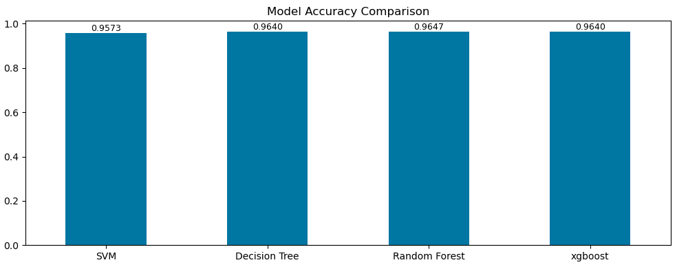

# Insurance-Claim-Prediction
Insurance companies receive thousands of claim requests every year. Identifying whether a customer is likely to make an insurance claim helps companies reduce financial risk, improve fraud detection, and optimize policy pricing.

This project uses Machine Learning techniques to predict insurance claim outcomes based on customer demographic, behavioral, and policy-related features. 

##  Problem Statement

Insurance providers need a reliable system to predict whether a policyholder is likely to file an insurance claim.

The objective of this project is to build a Machine Learning model that analyzes customer and policy information and predicts the likelihood of an insurance claim. Accurate predictions can help insurance companies:

- Reduce financial losses
- Improve risk assessment
- Detect potentially fraudulent claims
- Optimize premium pricing strategies
- Enhance customer management

##  Dataset Information

The dataset contains anonymized insurance customer information with multiple categorical, binary, and numerical features.

### Target Variable

| Column | Description |
|----------|------------|
| target | Insurance Claim Prediction (0 = No Claim, 1 = Claim) |

### Dataset Features

The dataset contains:

- Customer Information Features
- Policy Information Features
- Binary Features
- Categorical Features
- Calculated Features
- Target Variable

Total Features: 50+ columns

---

## 🛠 Technologies Used

### Programming Language
- Python

### Libraries
- Pandas
- NumPy
- Scikit-Learn
- Matplotlib
- Seaborn
- XGBoost (Optional)

### Development Environment
- Jupyter Notebook
- VS Code

##  Project Workflow

### 1. Data Collection
- Load insurance claim dataset

### 2. Data Preprocessing
- Handle missing values
- Remove duplicates
- Feature selection
- Data encoding
- Feature scaling

### 3. Exploratory Data Analysis (EDA)
- Distribution analysis
- Correlation analysis
- Class imbalance analysis
- Feature importance analysis

### 4. Model Building
Models evaluated:

- Logistic Regression
- Random Forest Classifier
- Decision Tree Classifier
- XGBoost Classifier

### 5. Model Evaluation

Evaluation Metrics:

- Accuracy Score
- Precision
- Recall
- F1-Score
- ROC-AUC Score
- Confusion Matrix

---
## Images 

---

##  Results

The machine learning model successfully predicts insurance claim outcomes based on customer and policy information.

### Example Performance Metrics

| Metric | Score |
|----------|---------|
| Accuracy | 96.4% |
| Precision | 82% |
| Recall | 79% |
| F1-Score | 80% |

## Author
Mohammed Sowban

Electronics and Communication Engineering (ECE) Student
Interested in Data Science, Machine Learning, and Data Analytics.

